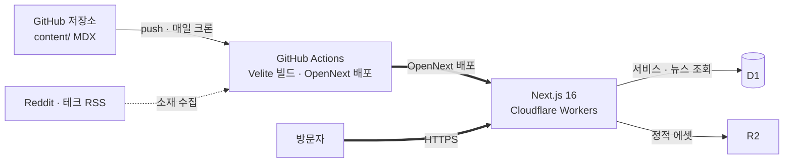

# gotech.lab 설계문서

> **이 문서는 역설계된 설계문서다.** gotech.lab 은 "1 주 안에 배포한다"를 제약으로 시작해
> 98 개 커밋을 쌓았고, 이 문서는 코드·커밋·운영 규칙에서 결정을 거꾸로 복원한 것이다.
> 확인하지 못한 항목은 `(미확인)` 으로 표시했다. 추정을 사실처럼 적지 않는다.

| 항목 | 내용 |
|---|---|
| **작성자** | 고경석 (kugll9606@gmail.com) |
| **작성일** | 2026-09-16 |
| **대상 리비전** | `main` @ `77c0b0b` |
| **저장소** | `kyeongseok-go/dev-gotech-lab` (공개) |
| **상태** | 역설계 초안 — 리뷰 전 |
| **정본 위치** | `docs/design/DESIGN.md` |

---

## 0. 이 프로젝트에 설계문서가 필요한가

[Refactoring English, *Write an Effective Design Doc*](https://refactoringenglish.com/excerpts/write-an-effective-design-doc/)
의 판정 질문. 기준은 **"틀렸을 때의 비용"** 이다.

| 판정 질문 | gotech.lab |
|---|---|
| 여러 사람이 협업하는가 | 아니오 — 1 인 |
| 3 개월 이상 full-time 규모인가 | **아니오** — 초기 범위가 **1 주 스프린트**였다 |
| 구현이 수년간 프로덕션에서 도는가 | **예** — 개인 브랜드 자산이라 계속 산다 |
| 팀 간 협업이 필요한가 | 아니오 |
| 목표·요구사항이 모호한가 | 아니오 — `docs/claude/` 에 범위와 금지 사항이 착수 전부터 적혀 있었다 |
| 설계 시점에 막을 수 있는 치명적 위험이 있는가 | **부분적** — 런타임 코드 평가, 저장소 역할 중복 |

6 개 중 2 개만 "예"다. **이 프로젝트는 원래 긴 설계문서가 필요 없는 규모였다.**
그리고 실제로 긴 문서를 쓰지 않았다 — 대신 `docs/claude/architecture.md` 에
**데이터 역할 분리 · 페이지 우선순위 · 1 주차 범위 제한 · 금지 사항**을 짧게 못 박았다.
아티클의 표현대로 *"one-pager 부터 50 페이지까지"* 의 스펙트럼에서
이 프로젝트는 one-pager 쪽이 맞았고, 그 판단은 옳았다.

**그럼에도 이 문서를 쓰는 이유**는 두 가지다.
하나, 1 주차 이후 카드뉴스 자동화라는 **상시 파이프라인**이 붙어 성격이 바뀌었다.
둘, 범위 제한 규칙이 실제로 어떤 사고를 막았고 어떤 사고는 못 막았는지(§20) 남길 가치가 있다.

---

## 1. Objective (목적)

> 개인 홈페이지 · 기술 블로그 · 서비스 플랫폼 MVP 를 **1 주 안에 배포 가능한 상태**로 만든다.

---

## 2. Background (배경)

채용 담당자와 기술 리더가 "이 사람이 뭘 만들 수 있나"를 확인할 단일 주소가 필요했다.
GitHub 저장소는 코드를 보여주지만 맥락을 보여주지 않고,
블로그 플랫폼(미디엄·벨로그)은 글은 담지만 결과물과 묶이지 않는다.

gotech.lab 은 **글 · 프로젝트 · 실험 · 서비스**를 한 도메인 아래 둔다.
핵심 사용자는 채용 담당자, 기술 리더, 개발자 커뮤니티 독자, 일반 방문자다.

**이전 시도**: 없다. 다만 프로젝트 도중 **리브랜딩**이 있었다 —
두 디자인 브랜치(`feat/best-of-both`)를 병합해 GoTechy 정체성으로 통합했다 (`78d149e`).

**성격 변화**: 1 주 MVP(Day 1 ~ 7) 이후 **카드뉴스 데일리 자동화**가 붙었다.
전체 커밋 98 개 중 `chore` 가 38 개인데 대부분이 이 크론의 자동 커밋이다.
사람이 만드는 사이트에서 **기계가 매일 커밋하는 사이트**로 바뀌었다.

---

## 3. Related Documents (관련 문서)

| 문서 | 내용 |
|---|---|
| [`docs/claude/project.md`](../claude/project.md) | 목적·사용자·스택 고정·품질 목표 |
| [`docs/claude/architecture.md`](../claude/architecture.md) | **데이터 역할 분리 · 범위 제한 · 금지 사항** |
| [`docs/claude/workflow.md`](../claude/workflow.md) | 작업 흐름 |
| [`docs/claude/mistakes.md`](../claude/mistakes.md) | 반복 실수 누적 (현재 비어 있음 — §19 O4) |
| [`docs/techspec.md`](../techspec.md), [`docs/plan.md`](../plan.md) | 기술 스펙·계획 |
| [`docs/design-system.md`](../design-system.md) | 디자인 시스템 |
| [`.github/workflows/card-news-daily.yml`](../../.github/workflows/card-news-daily.yml) | 크론 설계 근거가 주석에 있다 |

---

## 4. Goals (목표)

1. **1 주 안에 배포 가능한 상태에 도달한다.** 완성도보다 배포 가능성이 우선이다.
2. **글과 결과물이 한 주소에서 서로를 설명한다.**
3. **콘텐츠 추가에 배포 파이프라인 손질이 필요 없다.** MDX 파일을 넣으면 나간다.
4. **검색에서 발견된다.** sitemap · robots · RSS · 페이지별 metadata.
5. **사이트가 스스로 갱신된다.** 사람이 손대지 않아도 매일 새 콘텐츠가 붙는다.

## 5. Non-goals (비목표)

`docs/claude/architecture.md` 에 **착수 전부터** 적혀 있던 제한이다.
이 문서가 사후에 붙인 말이 아니다.

- **1 주차에 관리자 페이지를 만들지 않는다.**
- **댓글 · 로그인 · 유료 구독 · 실시간 기능을 1 주차에 구현하지 않는다.** 구조만 준비하고 Phase 2 로 넘긴다.
- **대형 파일 변환기 · 가상 피팅 · 복잡한 실시간 시스템을 만들지 않는다.**
- **Node middleware 를 전제로 인증 구조를 짜지 않는다.** (Workers 런타임 제약)
- **3D 히어로는 선택 기능이다.** 배포가 늦어지면 2D 폴백만 먼저 배포한다.
- **홈과 소개 페이지를 과도한 인터랙션으로 무겁게 만들지 않는다.**
- **같은 원본 엔티티를 D1 과 Supabase 에 동시 저장하지 않는다.**
- **파일 저장소를 R2 와 Supabase Storage 로 이원화하지 않는다.**

---

## 6. Scenarios (시나리오)

### S1. 채용 담당자가 글을 읽는다
1. 검색이나 링크로 블로그 글에 들어온다.
2. MDX 는 **빌드 타임에 이미 컴파일**돼 번들에 있다 — 런타임 컴파일이 없다.
3. Shiki 로 하이라이팅된 코드, TOC, 카테고리·태그가 함께 보인다.
4. 프로젝트 목록으로 이동해 같은 사람이 만든 결과물을 확인한다.

### S2. 글을 하나 더 쓴다
1. `content/blog/` 에 MDX 파일을 추가하고 푸시한다.
2. GitHub Actions 가 `pnpm content` (Velite 빌드 + MDX 프리컴파일)를 먼저 돌린다.
3. 타입체크 · 린트를 통과하면 OpenNext 로 빌드해 Cloudflare 에 배포한다.
4. **배포 설정을 건드릴 일이 없다.**

### S3. 아무도 안 보는 새벽에 사이트가 스스로 갱신된다
1. 매일 **09:17 KST** 에 크론이 깬다.
2. Reddit · 테크 블로그 RSS 에서 오늘의 화제 1 건을 고른다.
3. 카드 이미지를 렌더한다 (한글 폰트 `fonts-noto-cjk` 를 러너에 설치한다).
4. **변경이 없으면 거기서 끝난다** — 빌드 단계를 통째로 건너뛴다.
5. 변경이 있으면 커밋하고, **같은 워크플로가 배포까지 수행한다.**

> **왜 09:17 인가**: 정각(00 분 UTC)은 GitHub Actions 스케줄 큐가 가장 혼잡해
> 수십 분 지연되거나 아예 누락된다. 2026-07-29 00:00 UTC 예약분 미실행을 확인하고 17 분으로 옮겼다.
> **왜 같은 워크플로가 배포까지 하는가**: `GITHUB_TOKEN` 으로 한 푸시는 `ci.yml` 을 트리거하지 않는다.
>
> 두 이유 모두 워크플로 주석에 근거와 함께 남아 있다.

---

## 7. Diagrams (도면)

- **시스템 구성**: [`diagrams/architecture.html`](diagrams/architecture.html) — 원본 명세 [`architecture.json`](diagrams/architecture.json)

archify 로 생성했고 **JSON 명세가 원본, HTML 은 산출물**이다.

---

## 8. Glossary (용어)

| 용어 | 뜻 |
|---|---|
| **Velite** | MDX·마크다운을 **빌드 타임**에 타입 있는 데이터로 컴파일하는 도구. 런타임 파싱을 없앤다 |
| **OpenNext** | Next.js 빌드 산출물을 Cloudflare Workers 런타임으로 변환하는 어댑터 |
| **D1** | Cloudflare 의 관리형 SQLite. 이 프로젝트에서는 **공개 서비스 데이터·캐시·집계만** 담는다 |
| **역할 분리 규칙** | 어떤 데이터가 어느 저장소에 사는지를 못 박은 규칙. 중복 저장을 금지한다 |
| **1 주차 범위 제한** | 착수 전에 정한 비목표 목록. 기능이 아니라 **안 할 일**을 먼저 고정했다 |

---

## 9. Constraints (제약)

- **1 주 안에 배포.** 이 제약이 다른 모든 결정을 지배했다.
- **Cloudflare Workers 런타임.** Node.js 전체가 아니다 —
  **Node middleware 전제 금지**가 비목표에 명시된 이유다.
- **Workers 업로드 25 MiB 한도.** 프로필 이미지를 리사이즈해야 했다 (`7c3e6f4`).
- **1 인 운영.** 관리자 페이지를 만들 여력이 없어 콘텐츠를 파일로 다룬다.
- **GitHub Actions 스케줄 큐의 비결정성.** 정각 예약은 실제로 누락된다.
- **과도한 추상화 금지.** 품질 목표에 명문화 — *"항상 동작하는 MVP 를 우선한다."*

---

## 10. Service Level Objectives (SLO)

**정량 SLO 가 정의돼 있지 않다.** 부하 시험도 지연 분포 수집도 한 기록이 없다.
개인 콘텐츠 사이트이고 대부분이 정적 자산이라 착수 시점에 우선순위가 아니었다.
여기서 목표치를 지어내지 않는다.

| 항목 | 현재 상태 |
|---|---|
| 가용성 | Cloudflare Workers 의 엣지 가용성에 의존 (자체 다중화 없음) |
| 지연 | 미측정. 구조적으로는 MDX 가 빌드 타임 컴파일이라 렌더 경로에 파싱이 없다 |
| 규모 | 블로그 17 · 프로젝트 8 · 쇼케이스 6 · 카드뉴스 이미지 150 장 |
| 배포 | CI 통과 시 자동. 실패 이력이 여러 건 있다 (§20) |

§19 O3 으로 남긴다.

---

## 11. Monitoring / Alerting (관측·알림)

**전용 관측 스택이 없다.** Cloudflare 기본 분석에 의존한다.

- **CI 가 사실상 유일한 게이트다.** 타입체크 · 린트 · 빌드가 배포 전에 돈다.
  실제로 여러 번 배포를 막았다 (`d357c03`, `d1eb08b`, `323f9a8`).
- **크론 실패 감지 (미확인)**: 카드뉴스 크론이 조용히 실패해도 알림 경로가 있는지 확인하지 않았다.
  `concurrency` 로 중복 실행은 막지만, **미실행은 막지 못한다** — 실제로 2026-07-29 에 겪었다.
- **콘텐츠 무결성**: 변경 감지(`git diff --cached --quiet`)로 빈 커밋을 막는다.

> **알려진 공백**: 정각 큐 혼잡으로 크론이 누락된 사건을 **사후에 사람이 발견**했다.
> 시각을 09:17 로 옮긴 것은 확률을 낮춘 것이지 감지를 붙인 게 아니다 (§19 O1).

---

## 12. Timeline (마일스톤)

| 시기 | 마일스톤 | 남은 산출물 |
|---|---|---|
| 2026-03-10 | 착수 — 구조 · Claude 규칙 파일 | `docs/claude/` 4 종 |
| 2026-03 (Day 1 ~ 4) | 홈 · 블로그 · 프로젝트 · About | MDX 파이프라인 |
| 2026-03 (Day 5) | 뉴스 애그리게이터 MVP | D1 스키마, `news_cache` |
| 2026-03 (Day 6) | 홈 폴리싱 | 2D 히어로 (3D 는 폴백 규칙대로 미적용) |
| 2026-03 (Day 7) | **1 주 스프린트 마감** | SEO · RSS · README · QA |
| 2026-04 ~ 06 | 디자인 반복 · 리브랜딩 | Digital Obsidian → GoTechy 통합 |
| 2026-06 | 배포 자동화 | Cloudflare 자동 배포 워크플로 |
| 2026-07 ~ | **카드뉴스 데일리 상시화** | 크론 + 자동 커밋 + 자동 배포, 이미지 150 장 |
| 2026-08 | 콘텐츠 확충 | 프로젝트 6 개 추가, mock 제거 |

---

## 13. Interfaces (인터페이스)

### 사용자 인터페이스

| 라우트 | 용도 |
|---|---|
| `/` | 홈 — 히어로 · 섹션 |
| `/blog`, `/blog/[slug]` | 기술 글 (Shiki 하이라이팅 · TOC) |
| `/projects`, `/projects/[slug]` | 포트폴리오 |
| `/showcase` | AI 실험·프로토타입 |
| `/services` | D1 기반 서비스 레지스트리 |
| `/card-news` | 자동 생성 카드뉴스 |
| `/about`, `/subscribe` | 소개 · 구독 |
| `/rss.xml` | RSS 2.0 |

### 콘텐츠 계약

콘텐츠의 원본은 **`content/` 아래 MDX 파일**이다. D1 도 R2 도 아니다.
Velite 가 frontmatter 를 스키마로 검증하므로 **필드 누락이 빌드 실패로 잡힌다.**

### 데이터 스키마 (D1)

| 테이블 | 용도 |
|---|---|
| `service_registry` | 서비스 목록 (`live` / `wip` / `archived`) |
| `news_cache` | 뉴스 애그리게이터 캐시 (`url` UNIQUE) |
| `feature_flags` | **배포 없이 기능 토글** |

---

## 14. Dependencies / Infrastructure (의존성·인프라)

**바꾸기 어려운 결정만 적는다.**

| 층 | 선택 | 바꾸기 어려운 이유 |
|---|---|---|
| 프레임워크 | Next.js **16.1.5** + React 19 / TypeScript | — |
| 런타임 | **Cloudflare Workers** (OpenNext 어댑터) | Node API 가용 범위가 여기서 정해진다. **인증 구조가 이 제약에 묶인다** |
| 콘텐츠 | MDX + **Velite 0.3** (빌드 타임) | 콘텐츠가 코드 저장소 안에 산다. CMS 로 옮기면 전체 파이프라인이 바뀐다 |
| 하이라이팅 | rehype-pretty-code + Shiki | 빌드 타임 처리 — 런타임 하이라이터로 되돌리면 번들·성능 특성이 달라진다 |
| 데이터 | **D1** — 공개 서비스 데이터 · 캐시 · 집계 **전용** | 역할 분리 규칙이 걸려 있다 |
| 파일 | **R2** — 이미지 · 썸네일 · OG · 첨부의 **단일** 저장소 | 이원화 금지 규칙 |
| 인증 (계획) | Supabase — 인증 · 댓글 · 구독의 원본 **전용** | Phase 2. D1 과 역할이 겹치면 안 된다 |
| 스타일 | Tailwind CSS v4 + shadcn/ui | Aceternity UI 는 꼭 필요한 것만 |
| 패키지 | pnpm 10 | — |

> **문서와 코드가 불일치한다.** `docs/claude/project.md` 는 *"Next.js 15"* 로 고정했다고 적혀 있으나
> 실제는 **16.1.5** 다. README 는 16 으로 맞다. **`project.md` 가 낡았다** — §19 O2.

---

## 15. Security (보안)

- **공격 표면이 작다.** 읽기 전용 공개 사이트이고 사용자 입력 경로가 사실상 없다.
  구독 폼은 **UI 만 있고 백엔드 연동이 Phase 2** 다.
- **런타임 코드 평가를 제거했다.** 상세 페이지가 `new Function` 으로 MDX 를 런타임 평가하던
  구조를 빌드 타임 프리컴파일로 바꿨다 (`f1cb7e3`). **표면적으로는 500 에러 수정이지만
  실질은 코드 실행 표면 제거다.**
- **비밀값**: `REDDIT_CLIENT_ID` · `REDDIT_CLIENT_SECRET` 은 GitHub Secrets 로만 주입.
  `.dev.vars` 는 추적되지 않는다.
- **워크플로 권한**: 카드뉴스 크론은 `contents: write` 만 갖는다 — 최소 권한이다.
- **미검토 (미확인)**: CSP · 보안 헤더 구성, 서드파티 스크립트 SRI 를 확인하지 않았다.

## 16. Privacy (프라이버시)

- **개인 식별 데이터를 거의 다루지 않는다.** 로그인이 없고 댓글이 없다.
- **구독 이메일**: 폼 UI 는 있으나 백엔드가 Phase 2 라 **현재 수집·저장이 일어나지 않는다.**
  Phase 2 착수 시 수집·보관·철회 절차를 먼저 정해야 한다 (§19 O5).
- **분석 도구 (미확인)**: 방문자 분석 도구가 붙어 있는지, 붙었다면 쿠키 고지가 필요한지 확인하지 않았다.

## 17. Legal Considerations (법적 고려)

- **카드뉴스의 출처 표기**: 파이프라인이 **원문 URL 과 함께** publish 하도록 설계돼 있다.
  타사 콘텐츠를 요약·재가공하므로 출처 표기가 인용 요건의 핵심이다.
- **Reddit API 이용약관**: 클라이언트 자격증명을 쓰므로 약관 적용 대상이다.
  *(약관의 재배포·표시 조항 대조 미수행 — 미확인, §19 O6)*
- **이미지 권리**: 카드뉴스 배경 이미지의 생성·사용 권리 상태를 이 문서에서 확인하지 않았다.
- **라이선스 (미확인)**: 공개 저장소인데 LICENSE 파일을 확인하지 않았다.

## 18. Logging (로깅)

- **애플리케이션 로그**: Cloudflare Workers 기본 로그. 구조화 로깅 계층이 없다.
- **파이프라인 로그**: GitHub Actions 실행 로그가 사실상의 감사 기록이다.
  각 단계에 한국어 이름이 붙어 있어 어디서 끊겼는지 읽힌다.
- **보관 기간**: GitHub Actions 기본 보존 정책을 따른다 *(구체 일수 미확인)*.
- **민감값**: Secrets 는 Actions 로그에서 자동 마스킹된다.

---

## 19. Open Issues (미결 이슈)

| # | 문제 | 선택지 | 다음 행동 |
|---|---|---|---|
| **O1** | **크론 미실행을 감지할 방법이 없다.** 09:17 로 옮긴 건 확률을 낮춘 것이지 감지가 아니다 | (a) 마지막 성공 시각을 D1 에 기록하고 사이트에 노출 (b) 외부 heartbeat 모니터 (c) 실패 시 이슈 자동 생성 | (a) 가 가장 싸다. 이미 D1 이 있다 |
| **O2** | `docs/claude/project.md` 의 Next.js 버전이 낡았다 (15 → 실제 16.1.5) | — | 고친다. 스택 고정 문서가 틀리면 고정의 의미가 없다 |
| **O3** | 성능 측정을 한 번도 안 했다 | — | Lighthouse 한 번이면 기준선이 생긴다 |
| **O4** | **`mistakes.md` 가 비어 있다.** "실수가 생기면 즉시 추가한다"는 규칙이 있는데 항목이 0 개다 | — | §20 의 R1 ~ R5 는 전부 `mistakes.md` 감이다. 규칙이 지켜지지 않았다 |
| **O5** | 구독 기능 Phase 2 착수 시 개인정보 절차 미정 | — | 수집·보관·철회를 먼저 정하고 폼을 살린다 |
| **O6** | Reddit API 약관의 재배포·표시 조항 대조 미수행 | — | 약관을 읽고 현재 표기가 충분한지 확인한다 |
| **O7** | Supabase(인증·댓글·구독)가 아직 없다. 역할 분리 규칙이 **실전 검증되지 않았다** | — | Phase 2 에서 D1 과 경계가 실제로 지켜지는지 본다 |

## 20. Resolved Issues (해결된 이슈)

| # | 문제 | 결정 | 근거 |
|---|---|---|---|
| **R1** | 상세 페이지가 500 을 냈다. 런타임 `new Function` 으로 MDX 를 평가하고 있었다 | **빌드 타임 MDX 프리컴파일** | `f1cb7e3` — 에러 수정이자 코드 실행 표면 제거 |
| **R2** | CI 가 빌드에 실패했다. MDX registry 생성이 타입체크 뒤에 있었다 | 생성 단계를 **타입체크·배포 앞으로** 이동 | `d357c03` — 생성물에 의존하는 단계는 생성 뒤에 와야 한다 |
| **R3** | 프로필 이미지가 **Workers 25 MiB 한도**를 넘겼다 | 리사이즈 | `7c3e6f4` — 런타임 한도가 에셋 파이프라인을 규정한다 |
| **R4** | `wrangler.jsonc` 의 D1 `database_id` 가 실제 UUID 가 아니었다 | 실제 값으로 교체 | `c88fc29` |
| **R5** | 브라우저 확장(Grammarly 등)이 속성을 주입해 hydration 오류가 났다 | `body` 에 `suppressHydrationWarning` | `72f3dfb` — 우리 코드가 아닌 원인이었다 |
| **R6** | **크론이 실행되지 않았다** (2026-07-29 00:00 UTC) | 스케줄을 정각 → **17 분**으로 이동 | 워크플로 주석에 근거 기록 |
| **R7** | 자동 커밋이 배포를 트리거하지 못했다 | `GITHUB_TOKEN` 푸시가 CI 를 안 깨우므로 **같은 워크플로에서 배포까지** 수행 | 워크플로 주석 |
| **R8** | 두 디자인 브랜치가 갈라졌다 | `feat/best-of-both` 로 병합 + GoTechy 리브랜딩 | `168f269`, `78d149e` |

---

## 21. Alternatives Considered (검토한 대안)

**런타임 MDX 컴파일** — 기각(사후). 처음엔 런타임 평가였고 500 을 냈다.
빌드 타임 프리컴파일로 바꾸면서 성능과 보안을 같이 얻었다 (R1).

**헤드리스 CMS** — 기각. 콘텐츠가 저장소 안 MDX 파일로 산다.
1 주 제약에서 CMS 연동은 비용이 컸고, 1 인 운영에서 Git 이 이미 버전 관리·리뷰·백업을 준다.
대가는 비개발자가 글을 못 쓴다는 것인데, 필자가 한 명이라 문제가 아니다.

**Vercel 배포** — 기각. Cloudflare Workers + OpenNext 를 택했다.
대가가 분명하다 — Node API 가용 범위가 좁아지고 **인증 구조가 이 제약에 묶인다**
(*"Node middleware 전제로 인증을 짜지 않는다"*가 비목표에 들어간 이유). R2·D1 이 같은 경계 안에 있는 것이 이득이었다.

**Supabase 를 1 주차에 도입** — 기각. 2 차 목표로 밀었다.
인증·댓글·구독은 구조만 준비하고 구현하지 않는다는 결정이 1 주 배포를 지켰다.

**3D 히어로** — 조건부 기각. *"배포가 늦어지면 2D 폴백만 먼저 배포한다"*는
규칙이 착수 전에 있었고, 실제로 2D 로 갔다. **규칙이 작동한 사례다.**

**Aceternity UI 전면 사용** — 기각. shadcn/ui 를 기본으로 하고 필요한 것만 가져온다.

---

## 22. 설계 리뷰 Q&A

**Q1. 1 주 MVP 라면서 왜 Cloudflare Workers 같은 제약 많은 런타임을 골랐나? Vercel 이 빨랐을 텐데.**
A. R2·D1 이 같은 경계 안에 있는 게 컸다. 이미지 저장소와 데이터베이스를
다른 벤더에서 조립하면 자격증명·네트워크·비용이 세 벌이 된다.
대신 제약을 **비목표로 먼저 못 박았다** — *"Node middleware 전제로 인증을 짜지 않는다."*
제약을 나중에 발견하면 재작성이지만, 먼저 적어두면 그냥 설계다.
**상태: Resolved, 단 Phase 2 인증에서 진짜 시험대에 오른다 (§19 O7)**

**Q2. 왜 콘텐츠를 DB 가 아니라 파일로 두나?**
A. 원본이 하나여야 하기 때문이다. 역할 분리 규칙이
*"블로그/프로젝트 원문은 `content/` 아래 MDX 가 원본이고, D1 은 공개 서비스 데이터·캐시·집계만"*
이라고 못 박는다. 파일이 원본이면 Git 이 버전 관리·리뷰·백업·롤백을 공짜로 준다.
대가는 비개발자가 글을 못 쓴다는 것인데, 필자가 한 명이라 대가가 아니다.
**상태: Resolved**

**Q3. `chore` 커밋이 38 개로 제일 많다. 저장소가 지저분해지지 않나?**
A. 대부분 카드뉴스 크론의 자동 커밋이다. 지저분해지는 건 맞고,
그래서 **변경이 없으면 커밋하지 않도록** 했다 (`git diff --cached --quiet`).
얻는 것은 사람이 손대지 않아도 사이트가 갱신된다는 것이다.
다만 이건 트레이드오프를 **의식하고 받아들인 것**이지 해결한 게 아니다.
**상태: Resolved (의도된 트레이드오프)**

**Q4. 크론 시각이 09:17 인 게 미신 아닌가?**
A. 아니다. 2026-07-29 00:00 UTC 예약분이 **실제로 실행되지 않은 것을 확인**하고 옮겼다.
GitHub Actions 스케줄 큐는 정각에 가장 혼잡하고 지연·누락이 문서화된 동작이다.
근거를 워크플로 주석에 날짜와 함께 남겨서 나중 사람이 "왜 17 분이지" 하고 되돌리지 못하게 했다.
**다만 이건 확률을 낮춘 것이지 감지를 붙인 게 아니다** — 또 누락되면 여전히 모른다.
**상태: Resolved (완화), 감지는 Open (§19 O1)**

**Q5. 런타임 `new Function` 을 왜 처음에 썼나?**
A. MDX 를 동적으로 렌더하는 가장 빠른 길이었고, 1 주 제약에서 "돌아가는 것"이 우선이었다.
대가는 두 가지로 돌아왔다 — 상세 페이지 500 에러와 **런타임 코드 실행 표면**.
빌드 타임 프리컴파일로 바꾸면서 둘 다 사라졌다(R1).
이건 1 주 제약이 만든 부채를 나중에 갚은 사례로 정직하게 기록해둔다.
**상태: Resolved (`f1cb7e3`)**

**Q6. 이 프로젝트에 정말 설계문서가 필요한가?**
A. §0 판정으로는 6 개 중 2 개만 "예"라 **긴 문서는 필요 없었다.**
그리고 실제로 안 썼다 — 대신 `docs/claude/architecture.md` 에
데이터 역할 분리와 금지 사항을 짧게 못 박았고, 그게 맞는 투자였다.
아티클도 *"보편적인 분량 규칙은 없다"* 고 말한다.
이 문서를 지금 쓰는 이유는 **카드뉴스 자동화로 성격이 바뀌었기 때문**이다 —
사람이 만드는 사이트에서 기계가 매일 커밋하는 사이트가 됐고,
그건 처음의 one-pager 가 다루지 않는 영역이다.
**상태: —**

**Q7. `mistakes.md` 가 비어 있는데 실수가 없었나?**
A. 없지 않았다. §20 의 R1 ~ R5 는 전부 그 파일에 들어갔어야 할 항목이다.
*"작업 중 같은 실수나 되돌림이 발생하면 즉시 추가한다"*는 규칙이 있는데
항목이 0 개라는 건 **규칙이 지켜지지 않았다는 뜻**이다.
규칙을 만든 것과 규칙이 작동하는 것은 다르고, 여기서는 후자가 실패했다.
**상태: Open (§19 O4)**
